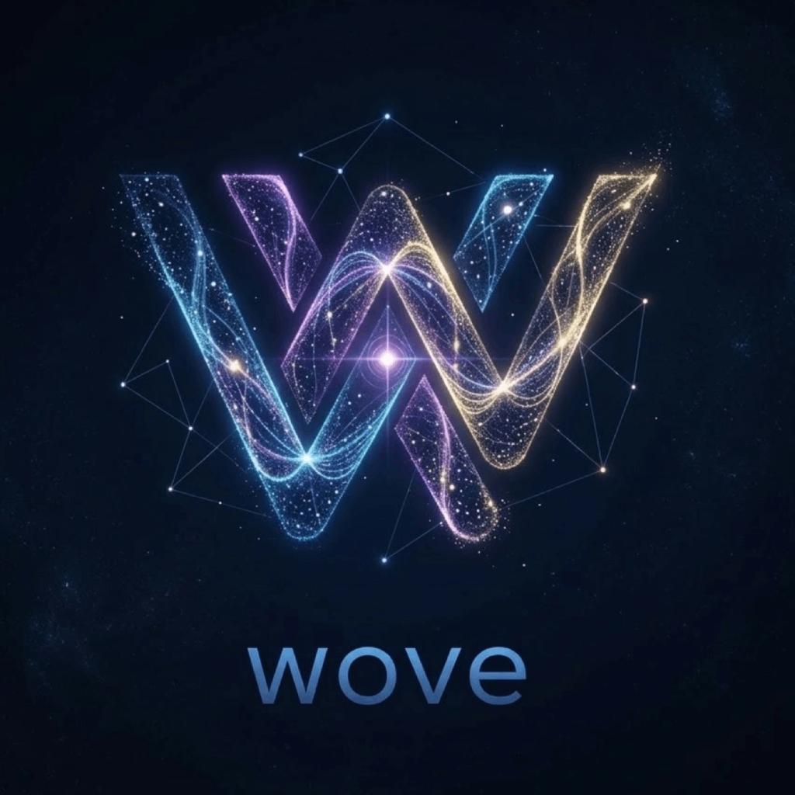

<p align="center">
  <picture>
    <source media="(prefers-color-scheme: dark)" srcset="./assets/wove-dark.png">
    <source media="(prefers-color-scheme: light)" srcset="./assets/wove-light.png">
    
  </picture>
</p>

# Wove

**Local, autonomous developer agent with built-in browser and computer vision.**

Wove is not a terminal with an AI chat. It's an autonomous agent that sees your screen, browses the web, runs commands, delegates sub-tasks, and orchestrates multi-step workflows — all running locally on your machine.

Built on the [Wave Terminal](https://github.com/wavetermdev/waveterm) engine (Go + Electron, Apache 2.0).

## What makes Wove different

| Capability | Cursor / Copilot | Claude Code | Wove |
|---|---|---|---|
| Built-in browser with vision | No | No | **CDP capture + Set-of-Mark** |
| Browser automation (click, type, navigate) | No | No | **Yes** |
| Sub-task delegation (isolated context) | No | Yes (subagents) | **Yes (new tabs)** |
| MCP native | No | Yes | **Yes (auto-detect)** |
| Execution plans with persistence | No | No | **Yes** |
| Project convention enforcement | Partial | .claude files | **WAVE.md + CLAUDE.md + .cursorrules** |
| Skills system (on-demand tools) | No | Slash commands | **SKILL.md + autocomplete** |
| Multi-model BYOK | Limited | Anthropic only | **10 presets, any provider** |
| Runs locally, no cloud agent | IDE extension | CLI | **Desktop app** |
| Open source | No | No | **Apache 2.0** |

## Core Capabilities

### Computer Vision & Web Automation
Wove sees web pages through CDP-based snapshots with Set-of-Mark numbered markers. The agent identifies interactive elements, reads content, and automates the browser:

- **web_capture** — visual snapshot with numbered element markers and CSS selectors
- **web_click** / **web_mouse_click** — click by selector or coordinates (CDP-based, works in iframes)
- **web_type_input** — type into inputs with framework event dispatch
- **web_exec_js** — execute JavaScript in page context
- **web_open** / **web_navigate** — open and navigate browser widgets
- **web_read_text** / **web_read_html** — extract content by CSS selector
- **web_seo_audit** — full page audit (JSON-LD, OG, meta, headings, links)

### Sub-task Orchestration
Complex tasks (audits, migrations, multi-file refactors) are split into isolated sub-tasks. Each sub-task runs in a new tab with fresh context and full tool access, preventing context window overflow.

```
Parent task: "Full SEO audit of example.com"
    |
    +-- Sub-task 1: Technical audit → /tmp/seo/01-technical.md
    +-- Sub-task 2: Content quality → /tmp/seo/02-content.md
    +-- Sub-task 3: Schema markup  → /tmp/seo/03-schema.md
    |
    v
Parent reads output files → generates consolidated report
```

### MCP Integration
Auto-detects `.mcp.json` in your project. AI gets direct access to your database schema, documentation, logs — any MCP-compatible data source.

### AI Planning System
Multi-step execution plans with:
- Concrete file paths and pattern references
- Auto-appended steps: lint, review, test
- Live progress panel
- Plans survive restarts

### Project Intelligence
Reads WAVE.md, CLAUDE.md, .cursorrules automatically:
- Tech stack injected into every request
- Critical rules always present
- Project tree on first message
- Smart filtering by technology

### Skills System
Extensible skill definitions (SKILL.md files) with:
- `invoke_skill` tool for on-demand loading
- Slash command autocomplete in AI input (`/seo-audit`, `/seo-technical`, etc.)
- Skills run autonomously end-to-end without confirmation prompts

### Widget Ownership & Cleanup
Agent tracks which terminals and browsers it created. Closes them when done. Cannot close user's pre-existing widgets.

### Multi-Model Support (BYOK)

| Provider | Models |
|---|---|
| Anthropic | Claude Sonnet 4.6, Opus 4.6 |
| OpenAI | GPT-5 Mini, GPT-5.1 |
| Google | Gemini 3.0 Flash, Pro |
| MiniMax | M2.7 |
| Ollama | Any local model |
| OpenRouter | Any model |

### Session History
Chat history persists per tab across restarts, with a visual banner showing previous work.

## Installation

macOS, Linux, and Windows.

### Build from source

```bash
git clone https://github.com/mits-pl/wove.git
cd wove
task init
task dev
```

### Requirements
- macOS 11+, Windows 10 1809+, or Linux (glibc-2.28+)
- Node.js 22 LTS
- Go 1.25+

## Configuration

### AI Modes
Configure in `~/.config/woveterm/waveai.json`:
```json
{
  "my-model": {
    "display:name": "My Model",
    "ai:apitype": "anthropic-messages",
    "ai:model": "claude-sonnet-4-6",
    "ai:endpoint": "https://api.anthropic.com/v1/messages",
    "ai:apitokensecretname": "my_api_key",
    "ai:capabilities": ["tools", "images", "pdfs"]
  }
}
```

### Project Instructions
Create `WAVE.md` in your project root:
```markdown
## Project
My App — Laravel 11, Inertia.js, Vue 3

## Conventions
- Always use Form Request classes for validation
- Use Eloquent scopes, not raw queries
- Run vendor/bin/pint after changes
```

## Architecture

```
User message
    |
    v
[Project Stack] -> "Laravel + Inertia + Vue"
[Critical Rules] -> "must write tests, must use PHPDoc"
[MCP Context]   -> database schema, app info
[Active Plan]   -> what step to execute next
    |
    v
Agent: plan -> read code -> write -> review -> test -> lint
    |
    +-- needs web data? -> web_open -> web_capture -> web_read_text
    +-- complex task? -> run_sub_task (isolated tab)
    +-- done? -> close_widget (cleanup)
```

## Built On

Wove is built on [Wave Terminal](https://github.com/wavetermdev/waveterm) by [Command Line Inc.](https://www.commandline.dev/), licensed under Apache License 2.0.

See [MODIFICATIONS.md](MODIFICATIONS.md) for a complete list of changes from upstream.

## Contributing

Issues and PRs welcome. See [CONTRIBUTING.md](CONTRIBUTING.md).

## License

Apache License 2.0. See [LICENSE](LICENSE).
